# Instructivo

### **Instructivo: Flujo de Trabajo con Estrategia Skip/Show/Ask en GitHub**  
*Para equipos de desarrollo que priorizan claridad, revisión eficiente y colaboración.*

---

### **1. Estrategia de Ramas (Skip/Show/Ask)**  
Clasifica las ramas según el tipo de cambio:  
- **Skip**: Cambios menores que no requieren revisión (ej: correcciones de typos, ajustes de formato).  
- **Show**: Funcionalidades o correcciones que **requieren revisión** antes de mergear.  
- **Ask**: Cambios complejos o experimentales que necesitan **discusión previa** (ej: refactorizaciones, integraciones críticas).  

---

### **2. Convención de Nombres para Ramas**  
Formato: `[tipo]/[tarea]-[descripción-breve]`.  
#### **Ejemplos**:  
- `skip/docs-update-readme`  
- `show/feat-user-auth`  
- `ask/refactor-payment-service`  

#### **Reglas**:  
- Usar **lowercase** y separar palabras con guiones (`-`).  
- Limitar la descripción a 5-8 palabras.  
- Incluir número de issue si aplica: `show/fix-issue-45`.  

---

### **3. Flujo de Trabajo con Git**  
#### **Crear una rama**:  
```bash
git checkout main  
git pull origin main          # Sincronizar con main
git checkout -b [nombre-rama] # Ej: git checkout -b show/feat-dark-mode
```

#### **Hacer commits**:  
- Usar mensajes claros siguiendo los templates (ver sección 5).  
- Ejemplo:  
```bash
git add .  
git commit -m "feat: add dark mode toggle"  
git push origin [nombre-rama]  
```
Los commits pueden ser parciales, cuando el cambio no está relacionado directamente con la modificación del archivo.
```bash
git add -p nombre/archivo_modificado  
```

Al ejecutar el comando, *Git* nos presentará cada bloque de código que ha sido modificado en el archivo, para aceptar o rechazar el cambio. Generando de esa forma un commit parcial, sin la necesidad de incluír todo el archivo y todas las modificaciones.

Luego de realizar el proceso de "add -p", completar el proceso de commit.

```bash
git commit -m "feat: add dark mode toggle"  
git push origin [nombre-rama]  
```


---

### **4. Templates para Mensajes de Commit**  
Crear un archivo `.gitmessage` en el repositorio y configurarlo globalmente:  
```bash
git config --global commit.template .gitmessage
```

#### **Contenido de `.gitmessage`**:  
```markdown
# [TIPO]: [DESCRIPCIÓN BREVE] (Max 50 caracteres)

# [CUERPO OPCIONAL: Explicar el "qué" y "por qué", no el "cómo".]

# === TIPOS VÁLIDOS ===
# feat: Nueva funcionalidad
# fix: Corrección de errores
# docs: Cambios en documentación
# refactor: Reestructuración de código sin añadir features
# test: Actualización de pruebas
# chore: Tareas de mantenimiento (ej: dependencias)
# skip: Cambios menores (no requiere revisión)
```

---

### **5. Proceso de Pull Request (PR)**  
#### **Crear un PR**:  
1. Ve a GitHub → **Pull Requests** → **New Pull Request**.  
2. Selecciona `main` como **base** y tu rama como **compare**.  
3. Usa el template correspondiente (Skip/Show/Ask).  

#### **Templates de PR (en `.github/PULL_REQUEST_TEMPLATE/`)**  
- **`skip-template.md`**:  
  ```markdown
  ## Tipo: Skip  
  ### Descripción  
  - [ ] Cambios menores (typos, formato, etc.).  
  - [ ] No afecta funcionalidad existente.  

  ### Checklist  
  - [ ] Revisado por el autor.  
  ```  

- **`show-template.md`**:  
  ```markdown
  ## Tipo: Show  
  ### Cambios  
  - [ ] Nueva funcionalidad  
  - [ ] Corrección de errores  

  ### Revisión Requerida  
  - Pasos para probar:  
    1. Paso 1...  
    2. Paso 2...  
  - Capturas de pantalla (si aplica):  
  ```  

- **`ask-template.md`**:  
  ```markdown
  ## Tipo: Ask  
  ### Contexto  
  - ¿Qué problema resuelve este cambio?  
  - ¿Qué alternativas se consideraron?  

  ### Discusión  
  - [ ] ¿Requiere aprobación de arquitectura?  
  - [ ] ¿Impacta en otras áreas del sistema?  
  ```  

---

### **6. Merge de Ramas**  
#### **Para ramas Skip**:  
- Merge directo (sin revisión):  
  ```bash
  git checkout main  
  git merge skip/docs-update-readme --no-ff  # Crea un commit de merge explícito
  ```  

#### **Para ramas Show/Ask**:  
1. **Revisión en GitHub**:  
   - Un revisor debe aprobar el PR (botón **Approve**).  
2. **Merge con squash**:  
   ```bash
   git checkout main  
   git merge --squash show/feat-dark-mode  # Combina todos los commits en uno
   git commit -m "feat: add dark mode toggle"
   ```  

---

### **7. Recomendaciones Adicionales**  
- **Protege la rama `main`**:  
  - Configura **branch protection rules** para bloquear merges sin PR aprobado.  
- **Sincroniza ramas frecuentemente**:  
  ```bash
  git fetch origin  
  git rebase origin/main  # Evita conflictos al mergear
  ```  
- **Limpia ramas obsoletas**:  
  ```bash
  git branch -d [nombre-rama]  # Local
  git push origin --delete [nombre-rama]  # Remoto
  ```  

---

### **8. Diagrama del Flujo**  

```mermaid
graph TD
  A[main] --> B{{Crea rama: skip/show/ask}}
  B --> C[Commits con template]
  C --> D[Push a GitHub]
  D --> E{Abrir PR}
  E --> |Skip| F[Merge directo]
  E --> |Show/Ask| G[Revisión y aprobación]
  G --> H[Merge con squash]
```


---

### **9. Herramientas de Apoyo**  
- **GitHub Actions**: Automatiza pruebas y despliegues al mergear.  
- **Codeowners**: Define responsables de revisar áreas específicas.  
- **Husky**: Aplica hooks de pre-commit para validar mensajes y código.  

---

¡Este flujo asegura un desarrollo ordenado, revisión eficiente y un historial de commits limpio! 🚀🔍
